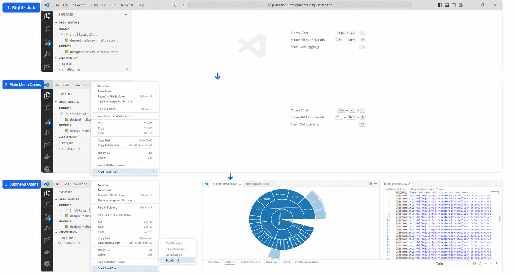

# 🕵️‍♀️ SmellScan-Pro

SmellScan-Pro is a 🔧 tool designed to scan the code and detect the design smells or violations of design principles. It evaluates language-independent design principles using language-specific semantic evidence.

Currently we release with Angular/TypeScript support, other languages will be added in subsequent releases.

## 🌟 Features

SmellScan-Pro is capable of detecting the following design smells in code:

### Abstraction Smells
1. [Imperative Abstraction](https://www.tusharma.in/smells/IA.html) 📚
2. [Unnecessary Abstraction](https://www.tusharma.in/smells/UA.html) 📦
3. [Unutilized Abstraction](https://www.tusharma.in/smells/catalog/UA2.html) 🎯

### Encapsulation Smells
4. [Deficient Encapsulation](https://www.tusharma.in/smells/DE.html) 📉
5. [Unexploited Encapsulation](https://www.tusharma.in/smells/catalog/UE.html) 🔐

### Hierarchy Smells
6. [Broken Hierarchy](https://www.tusharma.in/smells/BH.html) 🧩
7. [Cyclic Hierarchy](https://www.tusharma.in/smells/CH.html) 🔁
8. [Deep Hierarchy](https://www.tusharma.in/smells/DH.html) 🏞️
9. [Multipath Hierarchy](https://www.tusharma.in/smells/MH2.html) 🛤️
10. [Rebellious Hierarchy](https://www.tusharma.in/smells/RH.html) 🚧
11. [Wide Hierarchy](https://www.tusharma.in/smells/WH.html) 🌐
12. [Missing Hierarchy](https://www.tusharma.in/smells/catalog/MH.html) ⛓️

### Modularization Smells
13. [Broken Modularization](https://www.tusharma.in/smells/BM.html) 🧱
14. [Cyclic-Dependent Modularization](https://www.tusharma.in/smells/catalog/CM.html) 🔄
15. [Insufficient Modularization](https://www.tusharma.in/smells/catalog/IM.html) 📊
16. [Hub-like Modularization](https://www.tusharma.in/smells/catalog/HM.html) 🌀

## 🚀 Usage

To use SmellScan-Pro after installing the extension on VS Code, follow these steps:

1. Select and right-click the folder in the EXPLORER that you wish to scan. 📂
2. Go to the 'Start SmellScan' group in the context menu and select the language. 🖱️
3. A file named `designSmells.csv` will be generated containing the report. 📄
4. For enhanced visualization, a Sunburst chart will also be generated. 🌅

## 🤝 Contributing

We welcome contributions, issue reports, and feature requests! 🎉

To report issues, please visit:
- https://github.com/abhipsb/smellscan-pro 🐞

## 🆚 VS Code Compatibility

SmellScan-Pro supports VS Code version 1.88.0 or later. 🎯

## 🔄 Change log

### Version 1.0.0
- Initial release of SmellScan-Pro with Angular/TypeScript support.
- Added support for detecting 16 design smells across 4 categories:
  - **Abstraction**: Imperative Abstraction, Unnecessary Abstraction, Unutilized Abstraction
  - **Encapsulation**: Deficient Encapsulation, Unexploited Encapsulation
  - **Hierarchy**: Broken Hierarchy, Cyclic Hierarchy, Deep Hierarchy, Multipath Hierarchy, Rebellious Hierarchy, Wide Hierarchy, Missing Hierarchy
  - **Modularization**: Broken Modularization, Cyclic-Dependent Modularization, Insufficient Modularization, Hub-like Modularization
